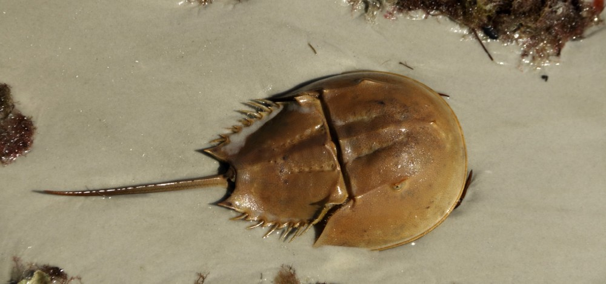

```{r setup, include=FALSE}
knitr::opts_chunk$set(echo = TRUE)
library(tidyverse)
library(knitr)
library(DT)
```


# Horseshoe Crabs
 

## Introduction

“Horseshoe crabs arrive on the beach in pairs and spawn … during … high tides. Unattached males also come to the beach, crowd around the nesting couples and compete with attached males for fertilizations. Satellite males form large groups around some couples while ignoring others, resulting in a nonrandom distribution that cannot be explained by local environmental conditions or habitat selection.” (Brockmann, H. J. (1996) Satellite Male Groups in Horseshoe Crabs, Limulus polyphemus, Ethology, 102, 1–21. )

### Data
We have a data set about 173 mating female crabs. Data collected included whether or not a male satellite was present (and how many if present) and the color, spine condition, weight, and carapace width of the femal crab.

```{r read_crab, echo=FALSE, warning=FALSE, message=FALSE}
#space delimited. sometimes 2 spaces. 
header <- c('color', 'spine', 'width', 
            'sat_ct', 'weight', 'sat_fg')
pretty_names <- c('Color', 'Spine Condition', 
                  'Carapace Width', 'Satellites Present', 
                  'Weight', 'Satellite Indicator')
#read in table and skip first line
#using read table because it's whitespace delimited
crabs <- read_table('crabs.txt', 
                    skip=1, col_names=header)

#decode color 2 = light, 3 = medium, 4 = dark, 5 = darker
#decode spine 1 = both good, 2 = one worn or broken, 3=both worn
#       or broken
#satellites indicator to text
crabs$color <- as.factor(crabs$color)
crabs$spine <- as.factor(crabs$spine)
crabs$sat_fg <- as.factor(crabs$sat_fg)

levels(crabs$color) <- c('light', 'medium',
                                  'dark', 'darker')
levels(crabs$spine) <- c('Both Good', 'One Worn/Broken',
                                  'Both Worn/Broken')
levels(crabs$sat_fg) <- c('No Satellite', 
                                  'At least 1 Satellite')
```

```{r crab_table, echo=FALSE}
#print to data table. searchable and pagination
datatable(crabs, colnames=pretty_names)
```

## Numeric Summaries
We’ll consider three categorical variables from the data set: female color, spine condition, and whether or not a satellite was present.

### Full Table
```{r crab_tables1, echo=FALSE}
tbl <- table(crabs$color, crabs$spine)
```
First, it's quite apparently that most horseshoe crabs have damage to both spines. Also, most horseshoe crabs are 'medium' in color. It looks like lighter color crabs may also have taken less damage to their spines. 
`r kable(tbl, caption='Color and Spine condition information')`

### Table by Satellite Indicator
```{r crab_tables2, echo=FALSE}
tbl <- table(crabs %>% select(color, spine, sat_fg))
```
It could be possible that females with no satellite take have less damage as well, but I am not confident of that. One thing is for sure, females tend to have at least one satellite.
`r kable(tbl[,,1], caption='For female crabs with no satellite:')`

`r kable(tbl[,,2], caption='For female crabs with at least 1 satellite:')`

## Visuals
### One Variable
The histograms seem to confirm the most basic of the observations above. Namely that: 

*  Female crabs tend to be medium in color, and very few light. 
*  Female crabs also have damage to both spines. 
*  Most female crabs have at least one satellite.

```{r crab_viz1, echo=FALSE}
ggplot(data=crabs, aes(x=factor(color))) +
  xlab('Female Crab Color') +
  geom_bar()

ggplot(data=crabs, aes(x=spine)) +
  xlab('Female Crab Spine Condition') +
  geom_bar()

ggplot(data=crabs, aes(x=sat_fg)) +
  xlab('') +
  geom_bar()

```

### Two Variables
In the first graph, it seems we can infer that medium and light color tend to have more satellites around. I do not see much in the second graph that seems useful. However, the last graph, our idea of darker colors indicating possibly injury to spines seems to stick out again. 

```{r crab_viz2, echo=FALSE}
ggplot(data=crabs, aes(x=color)) +
  xlab('Female Crab Color') +
  geom_bar(aes(fill=sat_fg), position='dodge') +
  labs(fill='') 

ggplot(data=crabs, aes(x=spine)) +
  xlab('Female Crab Spine Condition') +
  geom_bar(aes(fill=sat_fg), position='dodge') +
  labs(fill='') 

ggplot(data=crabs, aes(x=spine)) +
  xlab('Female Crab Spine Condition') +
  geom_bar(aes(fill=color), position='dodge') +
  labs(fill='Female Crab Color') 

```

### Three Variables
Again, we see the vast majority of crabs have spine injury, and they also tend to have both spines injuried as opposed to just one. Medium colored crabs are the most likely to have a satellite around as well. 
```{r crab_viz3, echo=FALSE}
ggplot(data=crabs, aes(x=color)) +
  xlab('Female Crab Color') +
  geom_bar(aes(fill=sat_fg), position='dodge') +
  labs(fill='') +
  facet_grid(cols=vars(spine), labeller = label_both)

```